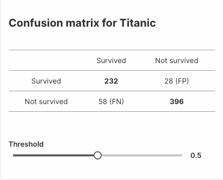

## Automatic Machine Learning (AutoML) for Wave Apps

This repository hosts Wave ML (`h2o-wave-ml`), a companion package for H2O Wave that makes it quick and easy to integrate AI/ML models into your applications.

Wave ML provides a simple, high-level API for training, deploying, scoring and explaining machine learning models, letting you build predictive and decision-support applications entirely in Python.

Wave ML runs on Linux, OSX, and Windows, and utilizes [H2O.ai's](https://h2o.ai) open-source [H2O](https://github.com/h2oai/h2o-3) and [AutoML](https://docs.h2o.ai/h2o/latest-stable/h2o-docs/automl.html) under the hood.

When Wave apps are run in [H2O AI Hybrid Cloud](https://www.h2o.ai/hybrid-cloud/) with GPU support, Wave ML optionally switches over to [Driverless AI](https://www.h2o.ai/products/h2o-driverless-ai/) for automatic feature engineering, machine learning, model deployment, and monitoring.

## Quickstart

**The API is under development and is not stable.**



```python
"""
Take a Titanic dataset, train a model and show a confusion matrix based on that model.
"""

from h2o_wave import main, app, Q, ui
import datatable as dt
from sklearn.metrics import confusion_matrix
from h2o_wave_ml import build_model

dataset = './titanic.csv'
target_column = 'Survived'

# Train model and make a prediction
model = build_model(dataset, target_column=target_column)
prediction = model.predict(dataset)

# Prepare the `actual` values from target_column
df = dt.fread(dataset)
y_true = df[target_column].to_list()[0]

template = '''
## Confusion Matrix for Titanic
| | | |
|:-:|:-:|:-:|
| | Survived | Not survived |
| Survived | **{tp}** | {fp} (FP) |
| Not survived | {fn} (FN) | **{tn}** |
<br><br>
'''


@app('/demo')
async def serve(q: Q):

    # Get a threshold value if available or 0.5 by default
    threshold = q.args.slider if 'slider' in q.args else 0.5

    # Compute confusion matrix
    y_pred = [p[1] < threshold for p in prediction]
    tn, fp, fn, tp = confusion_matrix(y_true, y_pred).ravel()

    # Handle interaction
    if not q.client.initialized:  # First visit, create a card for the matrix
        q.page['matrix'] = ui.form_card(box='1 1 3 4', items=[
            ui.text(template.format(tn=tn, fp=fp, fn=fn, tp=tp)),
            ui.slider(name='slider', label='Threshold', min=0, max=1, step=0.01, value=0.5,
                      trigger=True),
        ])
        q.client.initialized = True
    else:
        q.page['matrix'].items[0].text.content = template.format(tn=tn, fp=fp, fn=fn, tp=tp)
        q.page['matrix'].items[1].slider.value = threshold

    await q.page.save()
```

## API

### build_model()

```python3
def build_model(filepath: str, target_column: str, model_metric: ModelMetric = ModelMetric.AUTO,
                model_engine: Optional[ModelEngineType] = None, **kwargs) -> ModelEngine:
```

Trains a model. If `model_engine` not specified the function will determine correct backend based on a current environment.

- `filepath`: The path to the training dataset.
- `target_column`: A name of the target column.
- `model_metric`: Optional evaluation metric to be used during modeling, specified by `h2o_wave_ml.ModelMetric`.
- `model_engine`: Optional modeling engine, specified by `h2o_wave_ml.ModelEngine`.
- `kwargs`: Optional parameters passed to the modeling engine.

Returns:
    A Wave model.

### get_model()

```python3
def get_model(id_: str, model_engine: Optional[ModelEngineType] = None) -> ModelEngine:
```

Gets a model that can be accessed on a backend.

- `id_`: Identification of a model.
- `model_engine`: Optional modeling engine, specified by `h2o_wave_ml.ModelEngine`.

Returns:
    A Wave model.

### save_model()

```python3
def save_model(model_engine: ModelEngine, output_folder: str) -> str:
```

Saves a model to disk.

- `model_engine`: A model engine produced by `h2o_wave_ml.build_model`.
- `output_folder`: A directory where the saved model will be put to.

Returns:
    A path to a saved model.

### load_model()

```python3
def load_model(filepath: str) -> ModelEngine:
```

Loads a model from disk into the instance. This will always return a model with an `H2O 3` backend.

- `filepath`: Path to a saved model.

Returns:
    A Wave model.

## Environment variables

The environment variables ensure the correct behaviour of a function calls behind the scenes. Based on a setup the API might spawn a new `H2O 3` instance or use existing `DAI` instance, use plain password to authenticate or utilize OpenID Connect, etc.

Currently just one environment variable is available to set:

- `H2O_WAVE_ML_H2O3_URL`, if set the existing instance of `H2O 3` will be used instead of spawning a fresh one.

## Development setup 

A python of version `3.6.1` or greater is required.

1. Clone repo
2. Type `make setup`

## Examples

To build a model a dataset in `.csv` format is needed and target column needs to be specified:

```python
from h2o_wave_ml import build_model

train_set = './creditcard_train.csv'
model = build_model(train_set, target_column='DEFAULT_PAYMENT_NEXT_MONTH')
```

Once the model is built we can make a predictions on a training dataset:

```python
from h2o_wave_ml import build_model

test_set = './creditcard_test.csv'
train_set = './creditcard_train.csv'

model = build_model(train_set, target_column='DEFAULT_PAYMENT_NEXT_MONTH')
predictions = model.predict(test_set)
```

or store model onto disk. The resulting model file path is returned by the `save_model()` function call:

```python
from h2o_wave_ml import build_model, save_model

train_set = './creditcard_train.csv'
model = build_model(train_set, target_column='DEFAULT_PAYMENT_NEXT_MONTH')
path = save_model(model, output_folder='./')
```

If model stored, we can load it up and make predictions:

```python
from h2o_wave_ml import load_model

model = load_model('./MyModel')
predictions = model.predict('./Datasets/creditcard_test_cat.csv')
```

A `.predict()` method call takes either the file path or python object with a raw data. Column names need to be specified but without the target column. The example shows prediction on a one row:

```python
from h2o_wave_ml import load_model

data = [["ID", "LIMIT_BAL", "SEX"], [24001, 50000, "male"]]

model = load_model('./MyModel')
predictions = model.predict(data)
```
