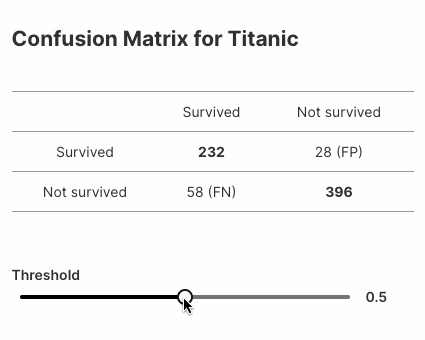

## Automatic Machine Learning (AutoML) for Wave Apps

This repository hosts Wave ML (`h2o-wave-ml`), a companion package for H2O Wave that makes it quick and easy to integrate AI/ML models into your applications.

Wave ML provides a simple, high-level API for training, deploying, scoring and explaining machine learning models, letting you build predictive and decision-support applications entirely in Python.

Wave ML runs on Linux, OSX, and Windows, and utilizes [H2O.ai's](https://h2o.ai) open-source [H2O](https://github.com/h2oai/h2o-3) and [AutoML](https://docs.h2o.ai/h2o/latest-stable/h2o-docs/automl.html) under the hood.

When Wave apps are run in [H2O AI Hybrid Cloud](https://www.h2o.ai/hybrid-cloud/) with GPU support, Wave ML optionally switches over to [Driverless AI](https://www.h2o.ai/products/h2o-driverless-ai/) for automatic feature engineering, machine learning, model deployment, and monitoring.

## Quickstart

The package can be installed using `pip`:

```shell script
pip install h2o-wave-ml
```

or along with H2O Wave:

```shell script
pip install h2o-wave[ml]
```

<kbd></kbd>

```python
"""
Take a Titanic dataset, train a model and show a confusion matrix based on that model.
"""

import datatable as dt
from h2o_wave import main, app, Q, ui
from h2o_wave_ml import build_model
from sklearn.metrics import confusion_matrix

dataset = './titanic.csv'
target_column = 'Survived'

# Train model and make a prediction
model = build_model(dataset, target_column=target_column)
prediction = model.predict(file_path=dataset)

# Prepare the `actual` values from target_column
df = dt.fread(dataset)
y_true = df[target_column].to_list()[0]

template = '''
## Confusion Matrix for Titanic
| | | |
|:-:|:-:|:-:|
| | Survived | Not survived |
| Survived | **{tp}** | {fp} (FP) |
| Not survived | {fn} (FN) | **{tn}** |
<br><br>
'''


@app('/demo')
async def serve(q: Q):

    # Get a threshold value if available or 0.5 by default
    threshold = q.args.slider if 'slider' in q.args else 0.5

    # Compute confusion matrix
    y_pred = [p[1] < threshold for p in prediction]
    tn, fp, fn, tp = confusion_matrix(y_true, y_pred).ravel()

    # Handle interaction
    if not q.client.initialized:  # First visit, create a card for the matrix
        q.page['matrix'] = ui.form_card(box='1 1 3 4', items=[
            ui.text(template.format(tn=tn, fp=fp, fn=fn, tp=tp)),
            ui.slider(name='slider', label='Threshold', min=0, max=1, step=0.01, value=0.5,
                      trigger=True),
        ])
        q.client.initialized = True
    else:
        q.page['matrix'].items[0].text.content = template.format(tn=tn, fp=fp, fn=fn, tp=tp)
        q.page['matrix'].items[1].slider.value = threshold

    await q.page.save()
```

## API

The API can be found on official Wave page [here](https://wave.h2o.ai/docs/api/h2o_wave_ml/index).

## Environment variables

The environment variables ensure the correct behaviour of a function calls behind the scenes. Based on a setup the API might spawn a new `H2O-3` instance or use existing `DAI` instance, use plain password to authenticate or utilize OpenID Connect, etc.

- `H2O_WAVE_ML_H2O3_URL`, if set the existing instance of `H2O-3` will be used instead of spawning a fresh one.

- `H2O_WAVE_ML_DAI_ADDRESS`, the address to the DAI standalone instance.
- `H2O_WAVE_ML_DAI_USERNAME`, the username to the DAI standalone instance.
- `H2O_WAVE_ML_DAI_PASSWORD`, the password to the DAI standalone instance.

- `H2O_WAVE_ML_STEAM_ADDRESS`, the Steam used for DAI provisioning.
- `H2O_WAVE_ML_STEAM_REFRESH_TOKEN`, the Steam user token allowing to connect without any other credentials (available inside Steam).
- `H2O_WAVE_ML_STEAM_INSTANCE_NAME`, the DAI instance name, Wave ML will use to train a model on.
- `H2O_WAVE_ML_STEAM_CLUSTER_NAME`, the DAI master node name, Wave ML will use to provision a new instance.
- `H2O_WAVE_ML_STEAM_VERIFY_SSL`, whether to switch on/off SSL verification in Steam connection (useful for local development).

- `H2O_WAVE_ML_MLOPS_GATEWAY`, the MLOps address.

- `H2O_WAVE_OIDC_PROVIDER_URL`, OIDC provider. Used for a token refresh.
- `H2O_WAVE_OIDC_CLIENT_ID`, OIDC client ID.
- `H2O_WAVE_OIDC_CLIENT_SECRET`, OIDC client secret.

## Development setup

A python of version `3.6.1` or greater is required.

1. Clone repo
2. Type `make setup`

## License

H2O Wave ML is licensed under the Apache License 2.0. See [LICENSE](LICENSE) for more information.
